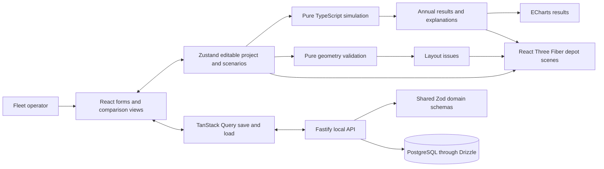
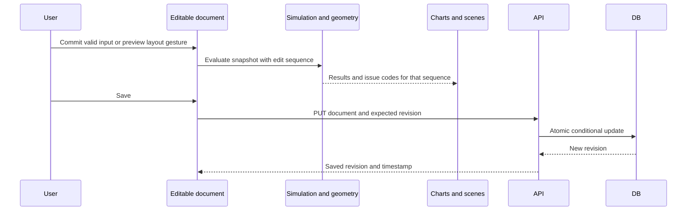

# System architecture

This document specifies the target implementation for the [product definition](proposal.md). Contracts and behaviors below are engineering decisions for implementation; they are not implemented merely because they are documented. Feature scope and schedule remain in [features](features.md) and the [weekly plan](weekly-plan.md).

## Current implementation

`apps/client` is a React/TypeScript/Vite/Tailwind application with Three.js, React Three Fiber/Drei, and Zustand. It currently edits a plane and cube in memory. `apps/server` is a Fastify application exposing `GET /health` and `GET /api`; its Drizzle schema is empty and its PostgreSQL factory is not used by request handlers. Tests cover existing state, controls, and the health API. There are no product APIs, migrations, CI workflows, or deployed product features yet.

TanStack Query, ECharts, Zod, Drizzle, and the PostgreSQL driver are already dependencies and are the selected foundations for their respective responsibilities. Keep existing package names and application locations. Do not add native application directories.

## Target components and ownership

| Boundary | Owner | Contract / responsibility |
|---|---|---|
| UI and charts | Dayton Ng Zhi Jie | Forms, tables, panels, dirty/save states, comparison charts; consume domain results rather than recalculate formulas. |
| Fleet domain | Yap Zhi Kai | Vehicle attributes, stable selection IDs, schedules, bay assignments, suitability scoring using simulation inputs. |
| Simulation | Elijah Chua Jye Kang | Pure annual calculations, charging constraints, cost/emissions breakdowns, impact explanations. |
| Visualization | Tan Wei Jun | Camera, picking, year-dependent meshes, freeform tools, constraints and dual scenes. |
| Assets | Jarrel Tay Wee Han | Scale, footprints, distinct ICE/EV/charger models, provenance and measured optimization. |
| Backend | Brandon Koh Kai Yang | Atomic document persistence, revision checks, validation, migrations, local database lifecycle. |
| Integration | Chew Shee Yang | Shared contracts, geometry validation/history support, CI, performance integration, release verification. |
| Product | Ooi Ming Thong | Flows, wireframes, acceptance review, scope and schedule coordination. |

When implementation introduces shared contracts, add `packages/domain` with Zod schemas and inferred TypeScript types, `packages/simulation` for pure calculations, and `packages/geometry` for pure layout checks. Add `packages/*` to workspace discovery then. Client and server consume domain schemas; simulation and geometry consume domain types. Domain imports no React, database, or rendering code. Simulation and geometry import neither each other nor server code; the client composes their issues. This documentation change creates none of these packages.

## Data ownership and update flow

A project contains a common fleet and analysis context plus independent scenario inputs. Vehicle/economic baseline changes are project-wide and affect both comparison plans; transition schedules, charger settings, depot tariffs, and layouts are scenario-specific. Label this distinction in the UI. Compare scenarios only inside one project revision so they share the same ICE baseline and analysis period.

Zustand owns the editable working document, active scenario, selection, timeline year, and transient edit history. TanStack Query owns last-loaded/saved server responses and request status. Never bind editable inputs directly to refetching server data. A save captures one document snapshot; edits made while saving remain dirty when that snapshot succeeds. Explicit reload requires confirmation if unsaved work would be discarded.

Recompute simulation when financial/operational/schedule/charging inputs change; year scrubbing only selects a cached annual result. Layout edits recalculate geometry and placement issues; dragging a charger does not alter its energy model. Evaluate once per animation frame during valid previews and synchronously on committed inputs initially. Keep an edit-sequence tag and discard stale asynchronous results if execution is later moved to a worker. A worker is not required for the first slice; profile before adding one.

Results are derived, not saved. Persist inputs and version information; rebuild results on load. Display the calculation model version in the assumptions/evidence view. Do not silently load unknown document versions.

## Current scene-editor architecture

The existing `sceneStore.ts` owns a versioned scene document, selection, and up to 100 immutable undo snapshots. Three.js objects and camera controls remain runtime references in the viewport. Coordinates use metres, Y-up, and XYZ Euler angles in radians, with degree conversion in the inspector. The plane is an 8 × 8 XZ surface; the cube has 2 metre sides. State resets on reload and objects have no physical constraints.

Reuse the existing `beginEdit`/`commitEdit`/`cancelEdit` conventions for target layout gestures. Target undo stores document changes but excludes camera, selected year, save revision, and query state. Saving does not clear history; loading/replacing a project does. See [editing/history](editing-and-history.md), [extension guidance](extending-the-editor.md), and the [target editor specification](design/depot-editor.md).

## Persistence and interfaces

[Domain and API contracts](contracts.md) define shared types, endpoints, validation, revision behavior, and tables. PostgreSQL holds complete versioned project documents atomically; normalized vehicle tables are unnecessary for this single-workspace product and would complicate coordinated snapshots. JSONB still requires full shared-schema and reference validation. The tradeoff is whole-document writes; the chosen reference workload is small enough for this design and must be measured.

No authentication, multi-user permissions, realtime collaboration, or public service operation is included. Target API binding is loopback with a same-origin production client and development proxy. Current server binding and permissive CORS are starter behavior that must be changed as part of API implementation. Do not imply the current demo already enforces the target boundary.

## Quality and delivery

[Calculation rules](simulation.md) define deterministic outputs and numerical fixtures. [Product design](design/product-design.md) and [wireframes](design/ui-ux/wireframes.md) define user behavior. [Verification](verification.md) provides all feature-to-test mappings, workloads, and milestone gates. [Engineering workflow](engineering-workflow.md) specifies local setup, CI, PRs, migrations, and evidence.

Ubuntu 24.04, macOS Tahoe, and Windows 11 are required development/build targets. Server execution/testing on Ubuntu 24.04 is required; a local demonstration is the delivery target. M6 closes acceptance. No cloud deployment or account setup is introduced by this design.
