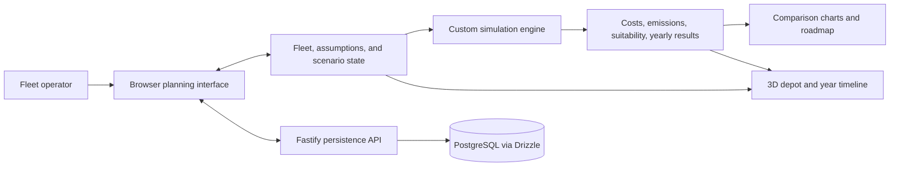

# Initial software architecture

Status: draft based on [the proposal baseline](proposal.md). Planned components below are implementation targets, not completed features.

## Current implementation

The pnpm workspace contains `apps/client` and `apps/server`. The client is a generic in-memory plane/cube editor built with React, TypeScript, Vite, Tailwind CSS, Zustand, Three.js, and React Three Fiber/Drei. It supports selection, property editing, and undo/redo. It does not yet model a fleet or call the backend.

The server uses TypeScript and Fastify with CORS and dotenv. It exposes `GET /health` and `GET /api`. A PostgreSQL connection factory and Drizzle configuration exist, but the schema is empty and the server does not currently connect to a database. Zod, TanStack Query, and ECharts are installed foundations; their presence does not mean validation, API integration, or product charts are implemented.

Vitest and Testing Library cover existing state, controls, and API behavior. There is no CI/CD workflow or deployment configuration yet.

## Current scene-editor architecture

`src/state/sceneStore.ts` in the client owns three separate concerns: a versioned, JSON-compatible scene document; editor selection; and up to 100 immutable undo snapshots. Three.js objects and camera controls stay in the viewport. State is in memory only and resets on reload.

Both interaction directions share the same actions:

- Inspector → transform/appearance action → document → subscribed scene mesh.
- Viewport click → selection action → editor selection → inspector and selection outline.

Coordinates use metres, Y-up, and XYZ Euler angles stored in radians; the inspector converts degrees at its boundary. The plane starts as an 8 × 8 XZ surface and the cube has 2 metre sides. Scale is applied to the parent transform, including the plane's Y axis. Objects do not have physics or collision constraints.

See [editing and history](editing-and-history.md) for edit transactions and shortcuts, and [extending the editor](extending-the-editor.md) for adding modules and object types.

## Target component relationships

This diagram describes the planned product. Only the generic UI/3D foundation and minimal server exist today; the depicted product data flows and persistence are not implemented.

## Implementation boundaries

- **Web UI:** fleet inputs, scenario controls, charging assumptions, comparison charts, and explanatory results. Zustand owns local editing state; planned TanStack Query integration handles persisted server data.
- **Vehicle systems:** fleet records, sample data, vehicle/group selection, transition schedules, and suitability inputs. Coordinate calculation inputs and explanations with the simulation owner.
- **Simulation engine:** deterministic TypeScript calculations accepting fleet, schedule, charging, and analysis assumptions and producing annual and aggregate results against an ICE baseline. Initially run in the browser to support immediate recalculation. Keep calculations independent of React, Three.js, and persistence.
- **3D systems and assets:** render scenario-driven bays, vehicles, chargers, and the selected year. Show space constraints and demand against a fixed connection limit, with red overload feedback. Rendering consumes scenario/results data rather than owning financial calculations.
- **Backend:** planned fleet/scenario persistence through Fastify, validated inputs, and PostgreSQL/Drizzle. Agree contracts and the data model at M1; no new endpoints or schema are defined by this documentation change.
- **Integration:** the technical lead coordinates contracts between vehicle systems, simulation, UI, visualization, and persistence. Introduce shared packages only when an actual shared consumer requires them.

## Data flow and validation

User edits update scenario inputs, which trigger calculations and refresh the comparison views and depot. Selecting a year changes the displayed vehicles, installed chargers, and demand for that year. Each comparison plan retains its own schedule and charging choices while using an explicit common baseline. Saving/loading is a planned API operation; current editor state resets on reload.

Keep units and assumptions explicit and show when payback is not reached within the analysis period. Verify calculation examples independently and integrate around the [proposal acceptance scenarios](proposal.md#acceptance-scenarios). Browser checks are required for WebGL interaction; DOM tests alone cannot establish visual correctness.

## Environment and delivery

Required development/build targets are Ubuntu 24.04, macOS Tahoe, and Windows 11. Server deployment and testing must at minimum support Ubuntu 24.04. These are requirements, not a claim of completed platform validation. Use the locked pnpm dependency graph and platform-neutral scripts documented in the [README](../README.md).

Future CI should run type checking, tests, and builds across the required environments, with Ubuntu server verification. Hosting, deployment automation, and credentials remain future decisions. See [ownership and handoff tracking](deliverables.md) for responsibilities and outstanding setup steps.
