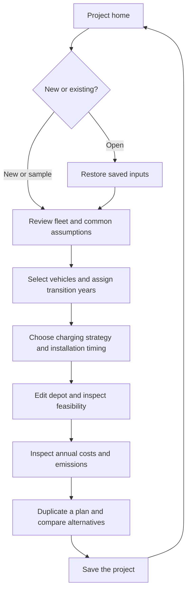

# Product design

Design owners: Ooi Ming Thong (UX), Dayton Ng Zhi Jie (web interface), and Tan Wei Jun (3D interaction). [Wireframes](ui-ux/wireframes.md) illustrate the screens; the [implementation features](../features/README.md) defines scope.

## Navigation and screen responsibilities

The application has a project home screen and a project workspace. The workspace offers Plan, Depot, and Compare views without navigating away from the current document. Its header always shows project/scenario names, saved/unsaved state, Save, and the simulation label. Common analysis settings and scenario-specific charging settings must be visibly distinguished.

| View | Primary content | Main actions |
|---|---|---|
| Home | Saved project list and synthetic sample entry | New project, Open, Open sample, delete project with confirmation |
| Plan | Fleet table, shared depot with the active scenario overlay, selected vehicle inspector, result panel | Vehicle CRUD, filters/groups, transition year, assumptions, results |
| Depot | Large scene, object list, editing tools, properties and validation issues | Site/obstacle authoring, bays/chargers, assignment, transforms, undo/redo |
| Compare | Plan A and B scenes/results, shared year selector and baseline description | Choose two scenarios, inspect differences, change year, return to edit |

At desktop widths of at least 1280 CSS px, Plan uses a roughly 280 px fleet pane, flexible scene, and 320 px inspector; results below the scene can collapse. Compare shows two equal columns. Below 1280 px, collapse the inspector into a drawer and allow comparison columns to scroll horizontally without hiding one plan's identity. At smaller widths, forms remain usable but precision authoring is designed for desktop pointer/keyboard use; no native mobile deliverable is implied.

## Main user journey

### Start and fleet setup

New project creates an empty fleet, one scenario named Plan A, and a 40 m × 30 m rectangular site that can be freely edited. The default analysis starts in 2026 for four years, currency SGD. Do not seed unverified market assumptions as authoritative values: the sample project uses explicitly labeled synthetic values from the [calculation fixtures](../tech/simulation.md#synthetic-worked-fixtures), while blank required economic fields in a newly added vehicle require entry before commitment.

Open sample creates a new unsaved project rather than modifying a shared saved sample. Use the SIM01 vehicle fixture as the initial economics demonstration and the SIM03 two-vehicle fixture as a charging constraint example; name them so the expected purpose is clear. Both samples identify their operational and charging assumptions. Selection does not edit data.

Fleet rows show ID/name/type, age, annual/daily distance, replacement year, transition year, and current status. Filters support type and age; sorting supports name, year, and suitability once implemented. Shift/range and checkbox selection permit arbitrary combinations; bulk transitions show the selected count before committing. Vehicle creation/editing happens in a labeled form. Removing a vehicle previews all affected scenario schedules/assignments.

### Plan a transition

Choose one or more vehicles and assign a year within the analysis period. Clear transition retains the vehicle's current preset. Update annual counts and the scene immediately after valid edits. A user can duplicate Plan A as Plan B and change ordering without changing A. The depot world remains shared; only scenario-specific schedules, assignments, and planning overlays are duplicated. Shared fleet edits affect both and are explicitly labeled “Applies to all scenarios.”

The year slider has discrete integer steps, accessible arrow-key behavior, and a numeric/year dropdown alternative. Changing the selected year does not change the plan. Charts show the full horizon and mark the selected year; scene state and selected-year KPIs use the same index.

### Charging and layout

The charging panel selects Depot, External, or Mixed. Depot forces share 100%; External forces 0%; Mixed accepts strictly between 0% and 100%. Show depot/external tariffs, efficiency, site limit, and charger inventory. A quantity increase previews new instances in a row near the site origin; the user can move them before committing. Do not silently resolve spatial conflicts. Quantity reduction asks which instances to remove, with their locations and installation years.

Each charger has a visible installation year and power. Selecting a year before installation shows the planned charger as a dashed/ghost object only in Depot authoring mode, labeled “Not installed this year”; Plan/Compare render installed infrastructure only. Show financial and feasibility consequences even when a financially cheap plan is operationally constrained.

Full editing behavior is in [depot editor](../tech/depot-editor.md). In Plan view, clicking a mesh selects the corresponding fleet/object row; clicking a row frames/highlights that item without changing the schedule.

### Results and comparisons

Show TCO, CAPEX, annual OPEX, baseline savings, operational emissions, and payback with units and short explanations. Use annual stacked cost bars, cumulative cash cost lines, annual emissions bars, and the transition roadmap. Show terminal residual credit separately so cumulative cash charts and residual-adjusted TCO are not confused.

Compare requires two distinct scenarios in the same project. Because a project can only link scenarios bound to its world, both comparisons use the same persisted depot world with different scenario overlays. If only one exists, offer Duplicate current plan. Both columns display the shared fleet/analysis revision and no-transition/current-fleet baseline. Controls in Compare inspect rather than edit scenarios; use Edit A/Edit B to return to the chosen Plan. Year selection is shared; cameras are independent with a Reset view command. No mandatory camera synchronization is added.

Each column includes scene, selected-year counts/demand, full-horizon financial/emissions KPIs, and warnings. Differences are labeled in direction (B minus A) with positive/negative meaning written out. Suitability appears as a sortable list of candidates with factor/reason details and site-wide constraint notices. It never automatically assigns transition years.

## State, validation, and recovery

| State | Required response |
|---|---|
| Blank/nonnumeric field draft | Keep locally, show a specific error on commit, and leave the last valid domain value unchanged; label displayed results as based on the last valid inputs. |
| Out-of-range/domain-invalid value | Block commit/save of that draft, focus the error, and explain the permitted range. Never render NaN totals. |
| Geometrically infeasible layout | Keep/edit/save the representable layout, highlight affected objects, and label calculations indicative/infeasible. |
| Empty fleet/results | Show zero totals with a prompt to add/load vehicles; ratios/payback that are undefined show an explanation rather than a misleading zero. |
| Unsaved project | Header shows Unsaved changes; leaving/reloading asks Save, Discard, or Cancel. Browser close uses the supported native warning. |
| Save in flight | Disable duplicate saves, allow editing, and retain dirty status for edits newer than the saved snapshot. |
| Save failure/offline backend | Keep all edits, display retry guidance and failure state; never clear dirty status. |
| Stale revision | Offer reload with discard confirmation or save as new project; no silent overwrite. |
| Unknown saved version | Keep the stored document intact, explain unsupported version, and offer return to project list. |
| Destructive change | Confirm deletion and list affected references; last scenario cannot be deleted. |

A collapsed panel retains its valid state. Undo/redo operates on committed domain edits, including geometry transactions, with up to 100 entries. A shared fleet edit undoes its coordinated scenario reference changes atomically. Camera, selection, active year, and saved revision are not undo entries.

## Accessibility and review

All forms and toolbar commands have visible labels/tooltips, keyboard access, focus indication, and error association. Status and overload are communicated in text as well as color. Numeric transform controls and object lists provide an alternative to pointer-only object movement. Diagram/charts include text summaries and numerical values. Keyboard shortcuts do not steal native form-field undo while text input has focus.

Usability checks cover planning, saving, comparison, depot editing, and the final end-to-end flow.
