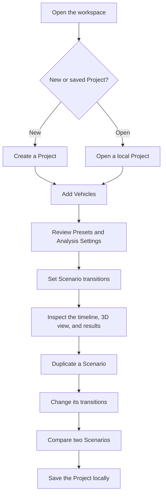

# Product design

Design owners: Ooi Ming Thong (UX), Dayton Ng Zhi Jie (web interface), and Tan Wei Jun (3D interaction).

The [wireframes](ui-ux/wireframes.md) show the M1 interface. The [feature catalogue](../features/README.md) defines implementation scope.

This document describes the current M1 application.

## Current M1 application

### Project and navigation

Each Project owns one environment. This environment contains one Depot and the shared fleet of Vehicles.

Vehicle Presets and Analysis Settings belong to the Project. Each Scenario contains Vehicle transition plans. Scenarios use the same environment.

The application opens in a workspace. `New` and `Open` show dialogs in that workspace.

The header contains the Project name, `New`, `Open`, `Import`, `Export`, `Save`, and the save status. It also contains two workspace tabs.

| Tab | Content | Main actions |
|---|---|---|
| `Plan / Depot` | 3D environment and a sidebar with feature panels | Edit Vehicles, Presets, Scenarios, and Analysis Settings. Select a year. Inspect results. |
| `Compare` | Two Scenario views, a shared timeline, results, differences, and a cost chart | Select two distinct Scenarios. Select a year. Inspect differences. Reset each camera. |

The `Plan / Depot` sidebar starts at 420 CSS px wide. A separator permits width changes.

At widths of 900 CSS px or less, the sidebar appears below the viewport. The separator then controls its height.

Compare uses two columns. Each column has a minimum width of 520 CSS px. Smaller screens permit horizontal scrolling.

The current interface supports browser use. Precise 3D editing requires desktop pointer and keyboard controls.

### Main user journey

```mermaid
flowchart TD
  Start[Open the workspace] --> Choice{New or saved Project?}
  Choice -->|New| New[Create a Project]
  Choice -->|Open| Open[Open a local Project]
  New --> Fleet[Add Vehicles]
  Open --> Fleet
  Fleet --> Inputs[Review Presets and Analysis Settings]
  Inputs --> Plan[Set Scenario transitions]
  Plan --> Results[Inspect the timeline, 3D view, and results]
  Results --> Alternative[Duplicate a Scenario]
  Alternative --> Change[Change its transitions]
  Change --> Compare[Compare two Scenarios]
  Compare --> Save[Save the Project locally]
```

### Create or open a Project

A new Project has an empty fleet, five synthetic Vehicle Presets, and one Scenario named `Plan A`.

It uses the default Depot and ten initial Vehicle positions. The analysis period starts in 2026 and lasts ten years, through 2035.

The default currency is SGD. Economic and emissions defaults are synthetic planning inputs. They are not verified market or manufacturer data.

`Open` lists Projects saved in the current browser. The list shows each Project name, Scenario count, and update time.

New Projects remain unsaved until the user selects `Save`. Import creates and saves a new Project identity from a portable file.

The application has no `Open sample` control. Sample Projects and the [worked calculation fixtures](../tech/simulation.md#synthetic-worked-fixtures) support tests and demonstrations.

### Fleet and transition planning

Fleet Management permits one Vehicle selection at a time. Each row shows the Vehicle name, ID, and selected-year status.

The selected Vehicle form contains its shared inputs. These inputs include its baseline Preset, operation, and current ownership or lease terms.

Shared fleet edits affect all Scenarios. A Vehicle deletion confirmation identifies Scenarios that contain its transition plan.

The current fleet capacity is ten Vehicles. `Add vehicle` uses the first available initial position.

The production transition controls edit the selected Vehicle's first transition. `Target preset` selects its next Preset. `Year to change` selects the transition year.

If the plan contains later transitions, these controls preserve them. Removing the first transition also preserves later transitions.

The production fleet interface has no filters, sorting, group selection, or bulk transition controls.

The Scenarios panel provides `New`, `Duplicate`, and `Remove`. Duplication copies transition plans into a new Scenario.

The environment, fleet, Presets, and Analysis Settings remain shared. The last Scenario cannot be removed.

### Timeline and 3D view

The Timeline panel contains an integer year slider, transition markers, an event list, `Play`, and `Reset`.

The selected year changes the derived Vehicle state and selected-year financial results. It does not change Scenario transition plans.

The year slider supports the browser's keyboard controls. There is no year dropdown in this panel.

The 3D view uses the same Project, active Scenario, and selected year as the results. Bright green Vehicles indicate a changed effective Preset.

The Vehicle rows also show `Current` or `Changed`. The default Depot and Vehicle transforms belong to the Project environment.

Development builds add a transform toolbar, Inspector, Scene panel, and Debug panel. They permit position, rotation, scale, and complete transition-list edits.

Production builds do not show these development tools. M1 does not include freeform site geometry, bays, obstacles, or chargers.

### Results and comparison

The `Cost & emissions` panel shows TCO, transition CAPEX, OPEX, baseline differences, payback, fuel, electricity, and operational emissions.

It also shows fleet cost per kilometre and mean cost per Vehicle. Undefined ratios show `Unavailable` or `N/A`.

The charts show cumulative cash cost, annual cash cost, and annual savings. An annual table supplies numerical values.

The cumulative chart marks the selected year and reached payback year.

TCO includes terminal residual credit and can include discounting. The cash charts show nominal cash flows.

Compare uses two distinct Scenarios from the open Project. Both columns use the same environment, fleet, Presets, and Analysis Settings.

With one Scenario, the second selection is disabled. The panel instructs the user to create or duplicate another Scenario in `Plan / Depot`.

Compare has no inline duplication control or `Edit A` and `Edit B` controls. The header tab returns the user to `Plan / Depot`.

Compare has a shared year slider, year buttons, `Play`, and `Reset`. Each scene has an independent camera and a `Reset view` control.

Differences use Plan B minus Plan A. The Difference panel uses signed values. Payback differences identify an earlier or later year.

The `Charging & feasibility` panel contains an information message. M1 results do not include charger inventory, charging strategies, or site-power calculations.

### Current validation and saving

| State | Current M1 response |
|---|---|
| Blank or invalid numeric draft | Keep the last valid Project value. Restore the valid value when the field loses focus or the edit ends. |
| Invalid Project name | Show a specific validation message in the name form. |
| Empty fleet | Show an instruction to add a Vehicle. Calculate zero totals where defined. |
| Unsaved Project | Show `Not saved yet` or `Unsaved changes` in the header. |
| New or Open with unsaved changes | Show a discard warning in the dialog. `Cancel` retains the open Project. |
| Import with unsaved changes | Require confirmation before replacing the open Project. |
| Browser close or reload with unsaved changes | Request the browser's native warning. |
| Save in progress | Show `Saving…`. Disable another save. Retain edits made after the captured save state. |
| Save failure or stale revision | Show `Save failed` and the failure message. Retain edits. Offer `Retry Save`. |
| Project list failure | Retain open edits. Show the error and `Retry`. |
| Unsupported or invalid Project file | Show an import error. Retain the open Project. |
| Scenario deletion | Show a confirmation dialog. Prevent removal of the last Scenario. |

`Saved locally` appears after IndexedDB accepts the captured Project state. It is not a server acknowledgement.

Edits made during a save remain unsaved after that save completes. A stale revision cannot silently overwrite the saved Project.

The current interface does not offer conflict-specific reload or save-as-new controls. General numeric fields do not show specific inline errors.

Undo and redo apply to committed Project edits. The history retains up to 100 states. Coordinated fleet and Scenario changes form one edit.

Camera state, selection, playback, and save metadata do not form Project history entries. A collapsed panel retains its valid state.

### Keyboard and text access

The workspace has a `Skip to workspace` link. Dialogs have named titles. Form controls have labels.

Timeline sliders and sidebar separators support keyboard input. The annual results table supplies numerical values for the financial charts.

Save and import failures use status or alert text. Fleet status uses `Current` and `Changed` labels as well as colour.

Text-field undo remains available while the field has focus. General numeric controls do not provide specific inline error messages.
