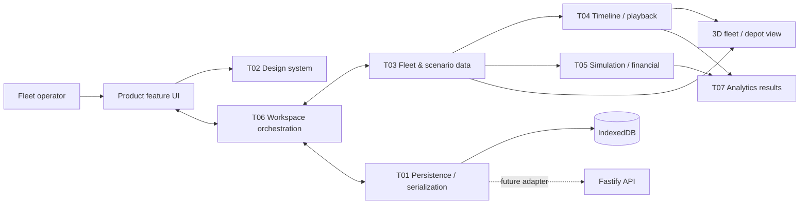
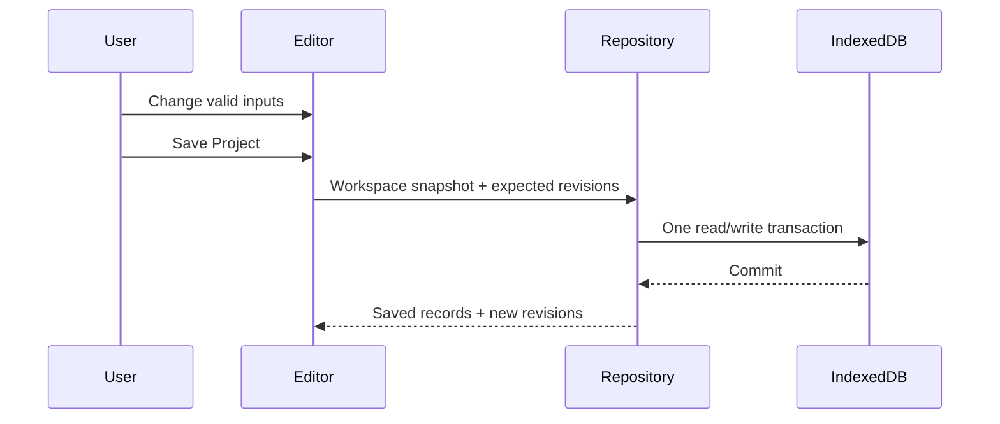

# System architecture

Design for the [Fleet Transition Planner](../proposal.md): a single-user browser application with persistent projects, an interactive depot, and deterministic scenario calculations. The [repository README](../../README.md) describes the current implementation.

## Technology stack

| Layer | Technology | Purpose |
|---|---|---|
| Browser interface | React, TypeScript, Vite, Tailwind CSS | Fleet inputs, scenario controls, and accessible interface |
| Application state | Zustand | Editable project, selected scenario/year, editor state, and undo history |
| Visualization | Three.js, React Three Fiber, Drei | Interactive depot and two-plan scenes |
| Charts | ECharts | Costs, emissions, and annual roadmaps |
| Prototype persistence | IndexedDB | Browser-local Project / World / Scenario storage |
| Future backend | Fastify, Zod | Retained for later server-side features/cloud persistence |
| Verification | Vitest, Testing Library, browser checks | Calculations, controls, integration, and visual behavior |

## Component relationships

The M1 architecture is organized around seven owned technical deliverables rather than around screen-local state.

The ownership boundaries are deliberate:

- **T01** stores/restores authoritative workspace data and portable project files.
- **T02** supplies reusable company-aligned UI primitives; it does not own product behavior.
- **T03** owns fleet/scenario domain data, references and effective selected-year vehicle state.
- **T04** owns the analysis clock, playback and event projection; it does not reimplement transition rules.
- **T05** owns deterministic numerical/financial results and is independent of React/persistence.
- **T06** owns Project/World/Scenario lifecycle, active selections, dirty state and workspace invariants.
- **T07** turns T05 outputs into KPI/chart view models; it does not independently recalculate financial truth.

Simulation, rendering and persistence remain separable so they can be tested independently and integrated through typed contracts.

## Data ownership and interaction

A project shares its vehicle presets, fleet, analysis period, currency, fuel price and emissions factors across one or more reusable 3D Worlds. Scenarios are separate saved transition plans bound to a World; they own transition decisions and scenario electricity/charging assumptions but do not own or duplicate the World document.

A project is edited as an in-memory workspace containing multiple Worlds and their world-bound Scenarios. Scene edits immediately update the active World in memory. Save Project is the persistence boundary: it captures every in-memory World and Scenario in one consistent snapshot. Failed saves preserve the working workspace. Revision conflicts can occur if another tab has updated a saved project/world/scenario since it was opened.

## Persistence boundary

IndexedDB database `fleet-transition-planner` stores `projects`, `worlds`, `scenarios`, ordered `projectWorlds` links, and ordered `projectScenarios` links as separate records. A Project may contain multiple Worlds; every Scenario references exactly one World. The repository validates every Scenario against a World included in the same project snapshot before committing.

The browser implementation is `IndexedDbProjectRepository`. Tests use the same `ProjectRepository` contract with an in-memory implementation. A future cloud/API adapter can replace the browser adapter without changing editor ownership or Scenario/World semantics.

Project files can also be exported as versioned `.fleetproject` JSON snapshots containing all project Worlds and Scenarios. Import validates the snapshot then creates fresh local Project/World/Scenario identities so importing cannot accidentally overwrite existing local data.

## Engineering decisions

- Deterministic browser-side calculations support immediate feedback and independent numerical testing.
- Stable vehicle/object identifiers maintain selection, schedules, and bay assignments across edits and saves.
- A flat metre-based depot model provides space checks without implying civil or electrical engineering precision.
- Invalid layouts remain editable and visibly constrained; financial results remain labeled indicative.
- Model versions, explicit assumptions, and worked examples make results explainable and reproducible.
- Browser-local persistence keeps the prototype zero-setup; cloud synchronization is deferred intentionally.

The [simulation model](simulation.md) and [depot editor](depot-editor.md) define the detailed calculation and editing behavior.

## Current scene-editor architecture

The editor keeps the active version 3 world document in Zustand while it is being edited, with separate editor selection/transform-tool settings and snapshot undo history. Serializable types live in `apps/client/src/scene/types.ts`; the developer catalog maps stable object definitions to procedural `THREE.Group` factories under `apps/client/src/models`. The viewport iterates document objects and dispatches through a typed renderer registry rather than depending on particular object IDs or shapes.

Each factory call creates an independently owned hierarchy, geometry, and materials. The renderer applies instance appearance overrides and creates a bounding outline, then disposes those resources on unmount. Inspector and viewport-gizmo editing change document transforms only; gizmo mode, world/local space, and snapping remain editor-only state. Project/scenario controls save through the browser-local repository; the 3D world remains in the scene store while editing but is persisted as its own World record. M1 simulation work is owned by T05 and consumes T03 contracts rather than scene/rendering objects. See [extending the editor](extending-the-editor.md) for catalog registration and resource ownership.
