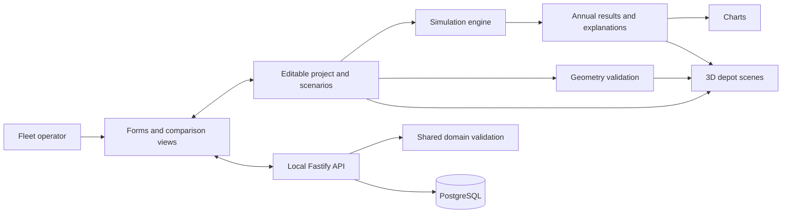
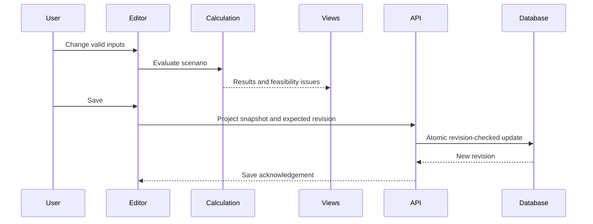

# System architecture

Design for the [Fleet Transition Planner](../proposal.md): a single-user local browser application with persistent projects, an interactive depot, and deterministic scenario calculations. The [repository README](../../README.md) describes the current implementation.

## Technology stack

| Layer | Technology | Purpose |
|---|---|---|
| Browser interface | React, TypeScript, Vite, Tailwind CSS | Fleet inputs, scenario controls, and accessible interface |
| Application state | Zustand | Editable project, selected scenario/year, and undo history |
| Server data | TanStack Query | Loading, saving, and request status |
| Visualization | Three.js, React Three Fiber, Drei | Interactive depot and two-plan scenes |
| Charts | ECharts | Costs, emissions, and annual roadmaps |
| API | Fastify, Zod | Local endpoints and shared input validation |
| Persistence | PostgreSQL, Drizzle | Versioned project storage and schema migrations |
| Verification | Vitest, Testing Library, browser checks | Calculations, controls, integration, and visual behavior |

## Component relationships

Simulation and geometry are independent of rendering and persistence. The interface displays their outputs without duplicating formulas. Shared domain definitions keep the browser and API consistent. Component ownership is recorded in [deliverables](../deliverables.md).

## Data ownership and interaction

A project shares its vehicle presets, fleet, analysis period, energy-price assumptions, and emissions factors across all scenarios. Each scenario has its own generic target-preset transition schedule, charging settings, relevant energy tariffs, and depot layout. Comparison therefore uses one no-transition/current-fleet baseline and two independent plans.

Financial input changes recalculate results. Year navigation selects annual results without changing schedules. Layout changes update geometry feedback; moving a charger does not change its electrical rating.

A save captures a consistent snapshot. Edits made during saving remain unsaved until acknowledged in a subsequent save. Failed saves preserve the working document; revision conflicts require an explicit choice to reload or save separately. Results are recalculated from versioned inputs rather than stored as independent values.

## Persistence and deployment boundary

PostgreSQL stores each complete project as one validated, versioned JSON document. Atomic project writes keep fleets, schedules, and layouts synchronized. Revision checks prevent one browser tab from silently overwriting another. The [data and API specification](contracts.md) defines this boundary.

The deployment design uses a local API and database, with no account system or public service. Ubuntu 24.04, macOS Tahoe, and Windows 11 are development/build targets; the server also requires execution and testing on Ubuntu 24.04.

## Engineering decisions

- Deterministic browser-side calculations support immediate feedback and independent numerical testing.
- Stable vehicle/object identifiers maintain selection, schedules, and bay assignments across edits and saves.
- A flat metre-based depot model provides space checks without implying civil or electrical engineering precision.
- Invalid layouts remain editable and visibly constrained; financial results remain labeled indicative.
- Model versions, explicit assumptions, and worked examples make results explainable and reproducible.

The [simulation model](simulation.md) and [depot editor](depot-editor.md) define the detailed calculation and editing behavior.

## Current scene-editor architecture

The current prototype implements an in-memory version 2 scene document, separate editor selection/transform-tool settings, and snapshot undo history in Zustand. Serializable types live in `apps/client/src/scene/types.ts`; the developer catalog maps stable object definitions to procedural `THREE.Group` factories under `apps/client/src/models`. The viewport iterates document objects and dispatches through a typed renderer registry rather than depending on particular object IDs or shapes.

Each factory call creates an independently owned hierarchy, geometry, and materials. The renderer applies instance appearance overrides and creates a bounding outline, then disposes those resources on unmount. No model loader, external file, URL, or asset cache participates in rendering. Inspector and viewport-gizmo editing change document transforms only; gizmo mode, world/local space, and snapping remain editor-only state. The viewport uses the TransformControls implementation shipped with the pinned Three.js version so its interaction logic stays aligned with the renderer; directional move/scale handles are kept on the positive axes instead of camera-flipping. Fleet business types, persistent projects, and simulation remain future work. See [extending the editor](extending-the-editor.md) for catalog registration and resource ownership.
