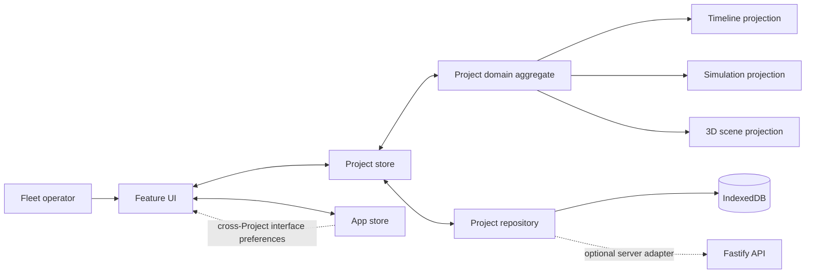

# System architecture

Design for the [Fleet Transition Planner](../proposal.md): a single-user browser application with persistent Projects, an interactive depot, and deterministic Scenario calculations.

## Technology stack

| Layer | Technology | Purpose |
|---|---|---|
| Browser interface | React, TypeScript, Vite, Tailwind CSS | Fleet inputs, Scenario controls, and accessible interface |
| Application state | Zustand | One editable Project aggregate plus editor state and history |
| Visualization | Three.js, React Three Fiber, Drei | Derived depot and vehicle views |
| Charts | ECharts | Costs, emissions, and annual roadmaps |
| Prototype persistence | IndexedDB | Browser-local Project records |
| Server API | Fastify, Zod, PostgreSQL | Aggregate Project persistence contract |
| Verification | Vitest, Testing Library, browser checks | Domain, state, integration, and visual behavior |

## Ownership boundaries


```mermaid
flowchart LR
  Operator[Fleet operator] --> UI[Feature UI]
  UI <--> Store[Project store]
  UI <--> AppState[App store]
  AppState -. cross-Project interface preferences .-> UI
  Store <--> Project[Project domain aggregate]
  Project --> Timeline[Timeline projection]
  Project --> Simulation[Simulation projection]
  Project --> Scene[3D scene projection]
  Store <--> Repo[Project repository]
  Repo --> IDB[(IndexedDB)]
  Repo -. optional server adapter .-> API[Fastify API]
```

The version 1 Project format is the sole editable domain and persistence boundary:

```text
Project
├── Environment
│   ├── Depot
│   └── Vehicles
├── Vehicle preset catalogue
├── Shared analysis settings
└── Scenarios
```

One Project owns exactly one physical environment, its Depot, authoritative Vehicles and transforms, Vehicle Presets, shared Analysis Settings, and ordered Scenarios. A separate World lifecycle is not part of the model; independent depots are separate Projects. Moving the Depot does not move Vehicles. The renderer derives typed Depot and Vehicle views from Project entities instead of storing a second scene document.

`useProjectStore` (`projectStore`) owns one `ProjectRuntime` for the complete `ProjectDocument`: the canonical document, repository metadata and save status, Project-scoped editor state, the saved baseline, and undo history. Plan runtime owns its selected year and playback state; Compare runtime independently owns Scenario A/B choices, selected year, and playback state. `ProjectDocument.activeScenarioId` remains the persisted and undoable Plan Scenario selection. Typed Project entities are world truth; rendered objects, simulation results, and analytics are projections. `useAppStore` (`appStore`) owns application-shell state that survives replacing the open Project: the derived Project catalogue, repository list/open status, global Project dialogs, workspace mode, and sidebar expansion. Project summaries are read-only repository projections, never editable copies of Project documents. Feature components issue Project commands; no feature mirrors authoritative Project data into another store. Validation, undo/redo, dirty state, save/load, simulation, and rendering therefore use the same Project source of truth. Scenarios own ordered Vehicle transition plans and reference Project Vehicles by stable identity.

M1 Scenarios contain no charging strategy, depot charging share, charger inventory, or other charging assumptions; those remain later product scope. The current environment has no persisted parking assignments or spawn-slot entities.

## Persistence boundary

The Project document format is version 1. `normalizeProject` validates that format at construction, mutation, repository, and import boundaries. The portable `.fleetproject` envelope also uses format version 1, independently of the Project document version.

Save Project writes one complete Project document through `ProjectRepository`. IndexedDB uses the stable `fleet-transition-planner` database name and internal database revision 5; that storage revision is independent of Project format version 1. Browser initialization creates the current `projects` store but does not port or automatically clear incompatible prerelease data. Clear incompatible local browser data manually.

The server's `schema_version` records the Project document format and is 1 for current rows. The migration runner remains the server schema-change mechanism; its prerelease SQL baseline deliberately drops the obsolete normalized `scenarios` and `projects` tables before creating the aggregate `projects` table. This destructive reset is allowed only before release. Future released schema changes must preserve supported data and can add versioned migrations without changing Project format version unless the document shape changes.

## Scene implementation

Depot and Vehicle transforms are authoritative fields of the Project environment. `createProjectWorld` is a read-only projection that combines those transforms with the selected Scenario and year. Typed world-object references preserve domain identity through picking, highlighting, Inspector routing, and development gizmos. Three.js objects, meshes, materials, simulation results, selection, lighting controls, and camera state are not persisted in the Project document.

The model catalogue maps stable model IDs to runtime factories. Production users create typed Vehicles through Fleet Management. Development tools may inspect and transform the typed Depot and Vehicles through Project commands; the catalogue does not create independently persisted scene instances.

See [contracts](contracts.md), [simulation](simulation.md), and [depot editor](depot-editor.md).
