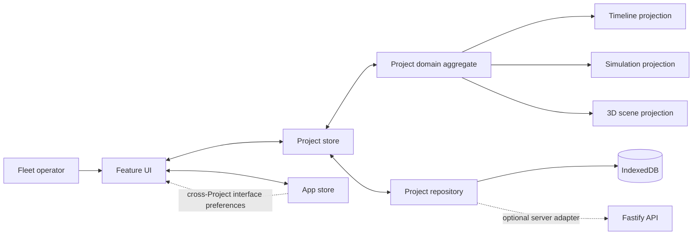

# System architecture

The [Fleet Transition Planner](../proposal.md) is a browser application for one user. It provides persistent Projects, an interactive Depot, and deterministic Scenario calculations.

## Technology stack

| Layer | Technology | Purpose |
|---|---|---|
| Browser interface | React, TypeScript, Vite, Tailwind CSS | Fleet inputs, Scenario controls, and Project workspace |
| Application state | Zustand | One editable Project aggregate, editor state, and history |
| Visualization | Three.js, React Three Fiber, Drei | Derived Depot and Vehicle views |
| Charts | ECharts | Annual and cumulative cash costs, and annual savings |
| Prototype persistence | IndexedDB | Project records in the browser |
| Server API | Fastify, Zod, PostgreSQL | Aggregate Project persistence contract |
| Verification | Vitest, Testing Library, browser checks | Domain, state, integration, and visual behavior |

## Ownership boundaries


```mermaid
flowchart LR
  Operator[Fleet operator] --> UI[Feature UI]
  UI <--> Store[Project store]
  UI <--> AppState[App store]
  AppState -. cross-Project interface preferences .-> UI
  Store <--> Project[Project domain aggregate]
  Project --> Timeline[Timeline projection]
  Project --> Simulation[Simulation projection]
  Project --> Scene[3D scene projection]
  Store <--> Repo[Project repository]
  Repo --> IDB[(IndexedDB)]
  Repo -. optional server adapter .-> API[Fastify API]
```

The following owners support these modules and their interfaces:

| Module or responsibility | Owner |
|---|---|
| Project domain and Vehicle Presets | Tan Wei Jun |
| Fleet Management and Timeline Control | Jarrel Tay Wee Han |
| Project and Scenario workspace | Brandon Koh Kai Yang |
| Simulation | Elijah Chua Jye Kang |
| 3D visualization, persistence, CI, and integration | Chew Shee Yang |
| Financial analytics | Yap Zhi Kai |
| Shared UI | Dayton Ng Zhi Jie |
| UX design | Ooi Ming Thong |

The shared UI library provides reusable components and design tokens. The product imports its theme, but its feature panels use local controls from `components/controls.tsx`. These panels do not use the shared UI component implementations.

The version 1 Project format is the only editable domain and persistence boundary:

```text
Project
├── Environment
│   ├── Depot
│   └── Vehicles
├── Vehicle preset catalogue
├── Shared analysis settings
└── Scenarios
```

One Project owns exactly one physical environment. It owns its Depot, authoritative Vehicles and transforms, Vehicle Presets, shared Analysis Settings, and ordered Scenarios. A separate World lifecycle is not part of the model. Independent Depots use separate Projects. A change to the Depot transform does not change Vehicle transforms. The renderer derives typed Depot and Vehicle views from Project entities. It does not store a second scene document.

`useProjectStore` (`projectStore`) owns one `ProjectRuntime` for the complete `ProjectDocument`. The runtime contains the canonical document, repository metadata, save status, Project editor state, saved baseline, and undo history. Plan runtime owns its selected year and playback state. Compare runtime owns separate Scenario A/B choices, selected year, and playback state. `ProjectDocument.activeScenarioId` is the persisted Plan Scenario selection. Project history includes changes to this selection.

Typed Project entities are authoritative. Rendered objects, simulation results, and analytics are derived projections. `useAppStore` (`appStore`) owns application state that survives a change to the open Project. This state includes the derived Project catalogue, repository list/open status, global Project dialogs, workspace mode, and sidebar expansion. Project summaries are read-only repository projections. They are not editable copies of Project documents.

Feature components issue Project commands. They do not copy authoritative Project data into another store. Validation, undo/redo, dirty state, save/load, simulation, and scene views use the same Project data. Scenarios own ordered Vehicle transition plans. These plans reference Project Vehicles by stable identity.

M1 Scenarios contain no charging strategy, Depot charging share, Charger inventory, or other charging assumptions. The current environment has no persisted parking assignments or spawn-slot entities.

## Persistence boundary

The Project document format is version 1. `normalizeProject` validates this format at construction, mutation, repository, and import boundaries. The portable `.fleetproject` envelope also uses format version 1. Its version is independent of the Project document version.

Save Project writes one complete Project document through `ProjectRepository`. Scenarios remain inside this aggregate record. The default browser repository uses IndexedDB. An API adapter already exists, but the default browser save path does not use it.

IndexedDB uses the stable database name `fleet-transition-planner` and internal revision 5. This storage revision is independent of Project format version 1. Browser initialization creates the current `projects` store. It does not convert or automatically clear incompatible prerelease data. Clear incompatible local browser data manually.

The server field `schema_version` records the Project document format. Current rows use version 1. The migration runner applies server schema changes. Its prerelease SQL baseline drops the obsolete normalized `scenarios` and `projects` tables. It then creates the aggregate `projects` table. This destructive reset is permitted only before release. The current baseline does not convert prerelease server data.

## Scene implementation

Depot and Vehicle transforms are authoritative fields of the Project environment. `createProjectWorld` combines these transforms with the selected Scenario and year in a read-only projection. Typed world-object references preserve domain identity for object selection, selection outlines, Inspector routes, and development gizmos.

The Project document excludes Three.js objects, meshes, materials, simulation results, selection, lighting controls, and camera state. The model catalogue maps stable model IDs to runtime factories. Production users create typed Vehicles through Fleet Management. Development tools inspect and transform the typed Depot and Vehicles through Project commands. The catalogue does not create separately persisted scene instances.

See [contracts](contracts.md), [simulation](simulation.md), and [Depot editor](depot-editor.md).

## Application audio

The application shell owns a Web Audio engine in the client. The engine is independent of Project state and sidebar component lifetime. Runtime audio configuration maps button activations and demo tracks to replaceable sound files under `/audio/`. One BGM voice and independent SFX voices can play at the same time. A new sound does not stop an active voice.

The Audio demo sidebar panel controls individual tracks and loops. Normal application audio consists only of button-click feedback. Playback and loop choices apply only to the session. They do not enter Project persistence or undo history. See [M1 audio](audio.md) for controls, runtime configuration, and the rubric demonstration.
