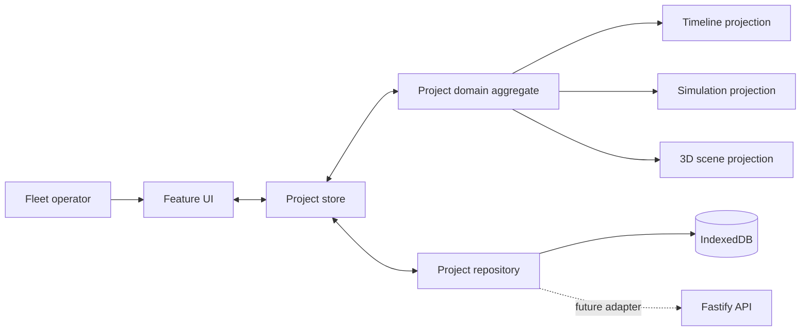

# System architecture

Design for the [Fleet Transition Planner](../proposal.md): a single-user browser application with persistent Projects, an interactive depot, and deterministic Scenario calculations.

## Technology stack

| Layer | Technology | Purpose |
|---|---|---|
| Browser interface | React, TypeScript, Vite, Tailwind CSS | Fleet inputs, Scenario controls, and accessible interface |
| Application state | Zustand | One editable Project aggregate plus editor state and history |
| Visualization | Three.js, React Three Fiber, Drei | Derived depot and vehicle views |
| Charts | ECharts | Costs, emissions, and annual roadmaps |
| Prototype persistence | IndexedDB | Browser-local Project records |
| Future backend | Fastify, Zod, PostgreSQL | Matching server-side persistence contract |
| Verification | Vitest, Testing Library, browser checks | Domain, state, integration, and visual behavior |

## Ownership boundaries


```mermaid
flowchart LR
  Operator[Fleet operator] --> UI[Feature UI]
  UI <--> Store[Project store]
  Store <--> Project[Project domain aggregate]
  Project --> Timeline[Timeline projection]
  Project --> Simulation[Simulation projection]
  Project --> Scene[3D scene projection]
  Store <--> Repo[Project repository]
  Repo --> IDB[(IndexedDB)]
  Repo -. future adapter .-> API[Fastify API]
```

The Project is the sole editable domain and persistence boundary:

```text
Project
├── Environment
│   ├── Depot
│   └── Vehicles
├── Vehicle preset catalogue
├── Shared analysis settings
└── Scenarios
```

The Project answers “what physical system am I planning?” A Scenario answers “what alternative plan am I evaluating for that system?” Scenarios own per-vehicle transition sequences. They reference vehicles and presets by stable ID and never duplicate the physical environment.

`useProjectStore` owns one `ProjectRuntime`: the canonical document, persistence metadata, Project-scoped editor state, and undo history. `useAppStore` owns cross-Project application state such as repository status, Plan/Compare workspace mode, and sidebar expansion. Feature components issue Project commands; no feature mirrors part of the document into another store. This keeps validation, undo/redo, dirty state, save/load, and rendering on the same source of truth without treating application-wide UI preferences as Project state.

## Persistence boundary

Save Project writes one complete Project document through `ProjectRepository`. IndexedDB stores one record per Project, with optimistic revision metadata outside the document. The API adapter implements the same interface. Portable files contain the same document and create a fresh Project identity on import.

The document's numeric `version` is a serialization concern. It does not appear in module, type, or store names, and no compatibility projection is kept in the runtime architecture.

## Scene implementation

Depot and vehicle transforms are authoritative fields of the Project environment. `createProjectWorld` is a render-only projection that combines those transforms with the active Scenario and selected year. Three.js objects, meshes, materials, selection, lighting controls, and camera state are not persisted in the Project document.

The model catalogue maps stable model IDs to runtime factories. Production users create typed Vehicles through Fleet Management. Development tools may inspect and transform the typed Depot and Vehicles through Project commands; the catalogue does not create independently persisted scene instances.

See [contracts](contracts.md), [simulation](simulation.md), [depot editor](depot-editor.md), and the [architecture decision](../adr/0001-project-owned-physical-environment.md).
