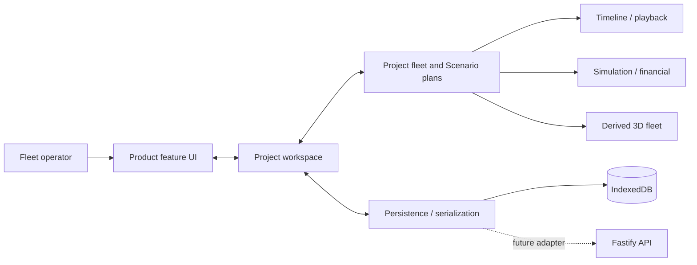

# System architecture

Design for the [Fleet Transition Planner](../proposal.md): a single-user browser application with persistent Projects, an interactive depot, and deterministic Scenario calculations.

## Technology stack

| Layer | Technology | Purpose |
|---|---|---|
| Browser interface | React, TypeScript, Vite, Tailwind CSS | Fleet inputs, Scenario controls, and accessible interface |
| Application state | Zustand | Editable Project, active Scenario/year, editor state, and undo history |
| Visualization | Three.js, React Three Fiber, Drei | Project depot and derived fleet views |
| Charts | ECharts | Costs, emissions, and annual roadmaps |
| Prototype persistence | IndexedDB | Browser-local Project and Scenario storage |
| Future backend | Fastify, Zod, PostgreSQL | Matching server-side persistence contract |
| Verification | Vitest, Testing Library, browser checks | Calculations, controls, integration, and visual behavior |

## Ownership boundaries


```mermaid
flowchart LR
  Operator[Fleet operator] --> UI[Product feature UI]
  UI <--> Workspace[Project workspace]
  Workspace <--> Domain[Project fleet and Scenario plans]
  Domain --> Timeline[Timeline / playback]
  Domain --> Simulation[Simulation / financial]
  Domain --> Scene[Derived 3D fleet]
  Workspace <--> Repo[Persistence / serialization]
  Repo --> IDB[(IndexedDB)]
  Repo -. future adapter .-> API[Fastify API]
```

A Project is the aggregate and persistence boundary:

```text
Project
├── Physical environment / scene
├── Authoritative fleet
├── Vehicle preset catalogue
├── Shared settings / assumptions
└── Scenarios
```

The Project answers “what physical system am I planning?” A Scenario answers “what alternative plan am I evaluating for that system?” Scenarios own per-vehicle transition decisions and Scenario-specific charging/electricity assumptions. They do not duplicate the scene or fleet.

`Project.fleet` is the authoritative collection of physical vehicle instances. Every vehicle has a stable ID, exactly one of the default depot's ten parking lots, and zero or one preset. The viewport derives its vehicle scene objects from this collection plus the active Scenario and selected year. Scene vehicle objects are never persisted independently.

## Persistence boundary

Save Project captures the Project document, active Scenario ID, and ordered Scenarios in one transaction. The Project document contains scene geometry, fleet, presets, and shared analysis settings. IndexedDB schema version 3 stores only `projects` and `scenarios`; Scenario rows reference `projectId`. Expected revisions prevent stale writes. Portable format version 3 stores the same aggregate and identifies the active Scenario by its order in the portable file.

The pre-release schema upgrade intentionally clears legacy multi-World data. No migration or compatibility layer is maintained.

## Scene implementation

The Project's version 3 scene document remains in the scene store while editing and is embedded in Project document version 4 at persistence boundaries. The default depot is created with every new Project and cannot be removed. Internal names such as `WorldScene` may remain as rendering implementation details; they are not persistence or lifecycle concepts.

The object catalogue, Inspector, arbitrary-object creation, transform toolbar, and scene debug panels are development tooling and are hidden from production builds. Production users add vehicles through fleet management. Vehicle rendering uses the vehicle's parking-lot transform and effective preset for the selected Scenario/year.

See [contracts](contracts.md), [simulation](simulation.md), [depot editor](depot-editor.md), and the [architecture decision](../adr/0001-project-owned-physical-environment.md).
