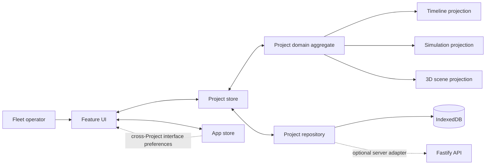

# System architecture

Design for the [Fleet Transition Planner](../proposal.md): a single-user browser application with persistent Projects, an interactive depot, and deterministic Scenario calculations.

## Technology stack

| Layer | Technology | Purpose |
|---|---|---|
| Browser interface | React, TypeScript, Vite, Tailwind CSS | Fleet inputs, Scenario controls, and accessible interface |
| Application state | Zustand | One editable Project aggregate plus editor state and history |
| Visualization | Three.js, React Three Fiber, Drei | Derived depot and vehicle views |
| Charts | ECharts | Costs, emissions, and annual roadmaps |
| Prototype persistence | IndexedDB | Browser-local Project records |
| Server API | Fastify, Zod, PostgreSQL | Aggregate Project persistence contract |
| Verification | Vitest, Testing Library, browser checks | Domain, state, integration, and visual behavior |

## Ownership boundaries


```mermaid
flowchart LR
  Operator[Fleet operator] --> UI[Feature UI]
  UI <--> Store[Project store]
  UI <--> AppState[App store]
  AppState -. cross-Project interface preferences .-> UI
  Store <--> Project[Project domain aggregate]
  Project --> Timeline[Timeline projection]
  Project --> Simulation[Simulation projection]
  Project --> Scene[3D scene projection]
  Store <--> Repo[Project repository]
  Repo --> IDB[(IndexedDB)]
  Repo -. optional server adapter .-> API[Fastify API]
```

The version 5 Project is the sole editable domain and persistence boundary:

```text
Project
├── Environment
│   ├── Depot
│   └── Vehicles
├── Vehicle preset catalogue
├── Shared analysis settings
└── Scenarios
```

The Project answers “what physical system am I planning?” A Scenario answers “what alternative plan am I evaluating for that system?” Scenarios own ordered Vehicle transition plans. They reference Vehicles and Presets by stable ID and never duplicate the physical environment. M1 Scenarios contain no charging strategy, depot charging share, charger inventory, or other charging assumptions; those remain later product scope. The current environment has no persisted parking assignments or spawn-slot entities.

`useProjectStore` (`projectStore`) owns one `ProjectRuntime` for a version 5 `ProjectDocument`: the canonical document, repository metadata, Project-scoped editor state, the saved baseline, and undo history. `useAppStore` (`appStore`) owns cross-Project interface state such as workspace mode and sidebar expansion. Feature components issue Project commands; no feature mirrors authoritative Project data into another store. Validation, undo/redo, dirty state, save/load, simulation, and rendering therefore use the same Project source of truth.

## Persistence boundary

Save Project writes one complete Project document through `ProjectRepository`. IndexedDB stores one record per Project, with optimistic revision metadata outside the document. The API adapter implements the same interface for the server-side aggregate repository. Portable files contain the same document and create a fresh Project identity on import.

The document's numeric `version` is a serialization concern. It does not appear in module, type, or store names, and no compatibility projection is kept in the runtime architecture.

## Scene implementation

Depot and Vehicle transforms are authoritative fields of the Project environment. `createProjectWorld` is a read-only projection that combines those transforms with the selected Scenario and year. Typed world-object references preserve domain identity through picking, highlighting, Inspector routing, and development gizmos. Three.js objects, meshes, materials, simulation results, selection, lighting controls, and camera state are not persisted in the Project document.

The model catalogue maps stable model IDs to runtime factories. Production users create typed Vehicles through Fleet Management. Development tools may inspect and transform the typed Depot and Vehicles through Project commands; the catalogue does not create independently persisted scene instances.

See [contracts](contracts.md), [simulation](simulation.md), [depot editor](depot-editor.md), [ADR 0001](../adr/0001-project-owned-physical-environment.md), and [ADR 0002](../adr/0002-project-aggregate-and-typed-world.md).
