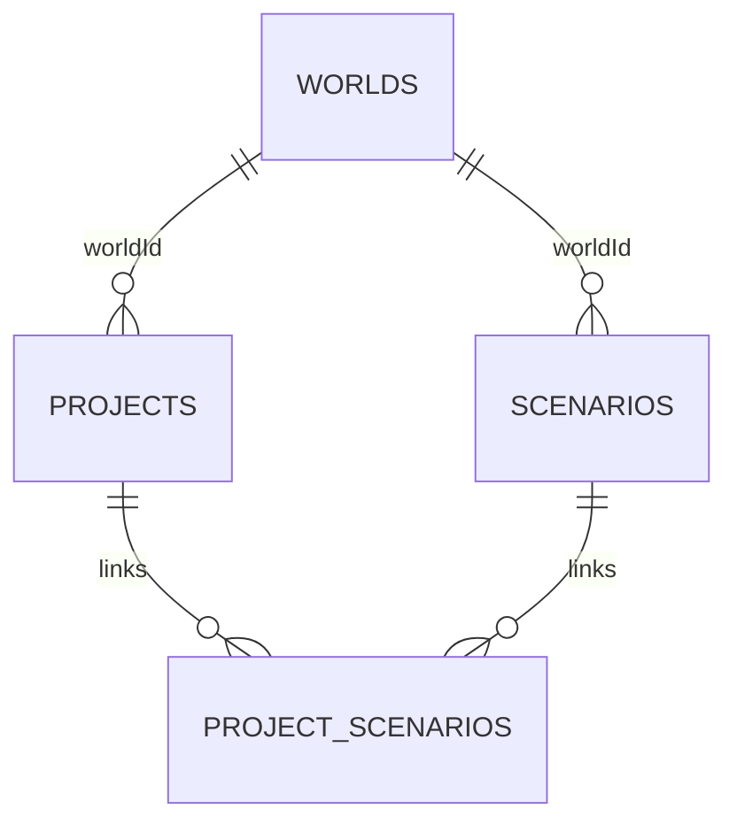

# Data model and persistence contract

Technical design for persistent fleet projects. A project contains shared project data and one reusable World together with independent Scenarios. Save/load preserves inputs, not rendered Three.js objects or calculated results.

## Data model

| Entity | Principal data | Relationship / purpose |
|---|---|---|
| Project | ID, name, revision, timestamps, project document | One saved workspace referencing one World |
| Vehicle preset | Stable ID, name/category, propulsion/energy source, efficiency/range/charging capability, economics | Project-level reusable preset |
| World | ID, name, revision, objects, transforms, scene settings | Reusable physical 3D depot |
| Scenario | ID, world ID, name, revision, planning inputs | Independent plan bound to one World; never embeds the World |
| ProjectScenario | Project ID, Scenario ID, World ID, order | Links compatible scenarios to a project |
| Result | Annual counts, cash flows, energy, emissions, feasibility issues | Derived; not persisted as authoritative input |

Geometry uses XZ ground coordinates in metres and rotations in radians. Scenario duplication copies planning data only; the project continues to reference the same World.

## Validation and consistency

- Names are nonempty and limited to 100 characters.
- Object IDs are unique within their collections and references must resolve.
- Each project contains at least one scenario.
- Every linked scenario must have the same `worldId` as its project.
- Removing a scenario from a project only removes the link; the separately saved scenario remains reusable by another same-world project.
- Unknown document/file versions are rejected explicitly.
- Invalid form drafts do not replace valid inputs.

## ProjectRepository

UI/state code depends on the `ProjectRepository` interface rather than on a storage technology. It provides:

- list saved projects
- load a complete workspace
- create an atomic workspace
- update an atomic workspace with expected revisions
- list/get reusable worlds
- list scenarios for one world only

The prototype implementation is native IndexedDB. Tests use an in-memory repository. A future HTTP/PostgreSQL implementation may implement the same interface.

## IndexedDB storage

Database: `fleet-transition-planner`, schema version 1.

Object stores:

| Store | Key / indexes | Content |
|---|---|---|
| `worlds` | key `id` | World records and serialized 3D document |
| `projects` | key `id` | Project records and project-level document |
| `scenarios` | key `id`, index `worldId` | Scenario records |
| `projectScenarios` | compound key `[projectId, scenarioId]`, indexes `projectId`, `worldId` | Ordered links |

One **Save Project** operation uses a single read/write transaction across all four stores. Project, World, and Scenario revisions detect stale writes from another tab. A failed transaction exposes no partial save.

## Portable project file

Export format identifier: `fleet-transition-planner-project`, version 1. The `.fleetproject` JSON contains:

- Project name and document
- World name and full 3D document
- Scenario names and documents
- Active scenario index
- Export timestamp

Export captures the live workspace, including unsaved edits. Import validates the structure and supported versions, then creates new project/world/scenario IDs before saving so imported data is an independent local copy.

Camera state, selection, gizmo settings, undo history, and derived results are excluded from persistence.

## Future API

Fastify/PostgreSQL code is retained as a future cloud-persistence path, but the current browser application does not call it for Project / World / Scenario persistence and does not require `DATABASE_URL`, PostgreSQL, Neon, or migrations to save/open a project.
