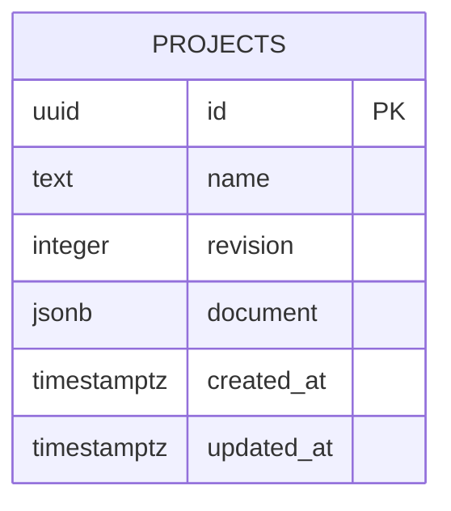

# Data model and API

Technical design for persistent fleet projects. A project contains a shared fleet and analysis context together with independent scenarios. Save/load preserves inputs, not rendered objects or calculated results.

## Data model

| Entity | Principal data | Relationship / purpose |
|---|---|---|
| Project | ID, name, revision, schema/model versions, timestamps | One consistent saved workspace |
| Analysis | Start year, duration, currency, fuel price, emissions factors | Shared baseline for all scenarios |
| Vehicle preset | Stable ID, name/category, propulsion/energy source, efficiency/range/charging capability, economics, maintenance, residual assumptions, physical dimensions | Shared project-level reusable preset |
| Vehicle | Stable ID, current preset reference, age, annual/daily distance, operations, replacement year | Shared fleet record |
| Scenario | ID, name, vehicle transition years, charging strategy, tariffs, depot | Independent alternative within a project |
| Site | Boundary polygon, connection limit, obstacle polygons | Physical planning area |
| Bay | ID, position, dimensions, rotation | One vehicle assignment per bay |
| Charger | ID, position, dimensions, power, costs, installation year | One simultaneously usable charging connector |
| Result | Annual counts, cash flows, energy, emissions, feasibility issues, TCO, payback | Derived from the saved input model |

Owned vehicles distinguish acquisition/current value and end-of-analysis residual. Leased vehicles specify annual payment and exit fee. These choices follow the [calculation model](simulation.md).

Geometry uses XZ ground coordinates in metres and rotations in radians. Charger quantity is the number of charger instances, avoiding disagreement between the physical layout and the cost model. Scenario duplication copies its layout and schedule while retaining references to the shared fleet.

## Validation and consistency

- All numeric inputs are finite. Costs, distances, emissions factors, and residuals are nonnegative; charger power, range, and footprint dimensions are positive.
- Analysis spans 1–20 whole years, starting between 2000 and 2100. Scheduled transitions, replacements, and installations lie within that period.
- Charging share is 0–100%; efficiency is greater than zero and at most 100%. Operating days range from 1–366; daily dwell from 0–24 hours.
- Names are nonempty and limited to 100 characters. Object IDs are unique within their collections, and references resolve within the project/scenario.
- Each project contains at least one scenario. A vehicle occupies at most one bay, and a bay holds at most one vehicle. Deletion identifies and removes associated references after confirmation.
- An empty fleet is valid. Undefined ratios display an explanation rather than zero, NaN, or Infinity.
- Invalid form drafts do not replace valid inputs. Structurally representable but spatially infeasible layouts can be saved with visible validation issues.
- One currency applies to the whole project; no currency conversion occurs. Unknown document/model versions are rejected explicitly.

## API

The local API uses JSON under `/api/v1`. Project updates are atomic, including scenario changes. The expected revision protects against conflicting browser tabs.

| Method and path | Request | Successful response | Important errors |
|---|---|---|---|
| GET /api/v1/projects | None | Project summaries, newest update first | 503 database unavailable |
| POST /api/v1/projects | Name and complete document | 201 project record, revision 1 | 400 validation/version; 413 size limit |
| GET /api/v1/projects/:id | Project ID | 200 complete project record | 400 invalid ID; 404 missing |
| PUT /api/v1/projects/:id | Expected revision, name, document | 200 saved record with incremented revision | 400 validation; 404 missing; 409 revision conflict |
| DELETE /api/v1/projects/:id | Expected revision | 204 | 404 missing; 409 revision conflict |
| GET /api/v1/ready | None | 200 database-ready result | 503 database unavailable |

Request bodies are limited to 10 MiB. Error responses contain a stable code, readable message, and field errors where applicable, without credentials or database internals. A failed save retains local edits. A revision conflict offers reload with discard confirmation or save as a separate project.

## Storage and integrity

Shared domain validation runs before writes. Conditional revision checks and transactions prevent partial updates and stale overwrites. Stored documents include schema and calculation-model versions. Database migrations are versioned and tested against new and existing project data.

Camera state, selection, undo history, and derived results are excluded from persistent storage.
