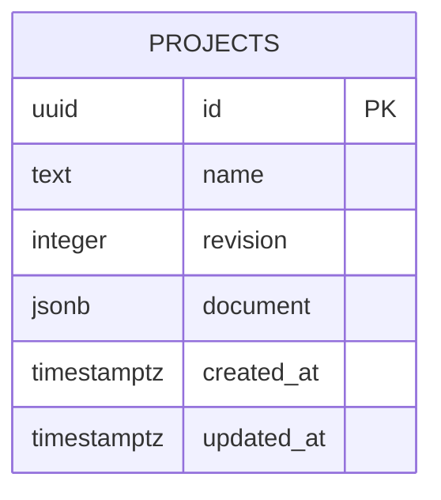

# Domain and local API contracts

Target contracts for T004, T008, T017, T028, and T050 in the [weekly plan](../weekly-plan.md). These are not existing exported types or endpoints. Implement runtime Zod schemas first and infer the TypeScript types. All persisted numbers must be finite; JSON must contain no runtime objects, functions, NaN, or Infinity.

## Shared document types

The following is the minimum shared shape. IDs are UUID strings generated by the client for document objects; project IDs are generated by the server. Arrays store each vehicle/object once, and groups are selections of IDs rather than a second aggregate vehicle model.

```ts
type Id = string;
type Year = number; // integer calendar year
type Point2 = { x: number; z: number }; // metres, XZ ground plane

type Acquisition =
  | { kind: "owned"; purchaseCost: number; endResidual: number }
  | { kind: "leased"; annualPayment: number; exitFee: number };
type CurrentHolding =
  | { kind: "owned"; currentValue: number; endResidual: number }
  | { kind: "leased"; annualPayment: number; exitFee: number };

type Vehicle = {
  id: Id; label: string; type: string; ageYears: number;
  annualKm: number; typicalDailyKm: number; operatingDays: number;
  routeType: string; routePredictability: "predictable" | "variable";
  returnsToDepot: boolean; depotDwellHours: number;
  externalChargingAccess: boolean; utilisation: number; // 0..1
  replacementYear: Year | null;
  ice: {
    current: CurrentHolding; replacement: Acquisition;
    litresPer100Km: number; annualMaintenance: number;
  };
  ev: {
    acquisition: Acquisition; kWhPer100Km: number;
    assumedRangeKm: number; annualMaintenance: number;
  };
};

type Analysis = {
  startYear: Year; years: number; currency: string;
  fuelPricePerLitre: number; fuelKgCO2ePerLitre: number;
  electricityKgCO2ePerKWh: number;
};
type Footprint = {
  centre: Point2; widthM: number; depthM: number; rotationRad: number;
};
type Bay = { id: Id; label: string; footprint: Footprint };
type Charger = {
  id: Id; label: string; type: string; footprint: Footprint;
  powerKW: number; purchaseCost: number; installationCost: number;
  installationYear: Year;
};
type Depot = {
  boundary: Point2[];
  obstacles: { id: Id; label: string; vertices: Point2[] }[];
  bays: Bay[]; chargers: Charger[];
  bayByVehicleId: Record<Id, Id>; // vehicle -> bay; absence = unassigned
  connectionLimitKW: number;
};
type Scenario = {
  id: Id; name: string;
  transitionByVehicleId: Record<Id, Year>; // absence = retain ICE
  charging: {
    strategy: "depot" | "external" | "mixed";
    depotShare: number; // 0..1; depot=1, external=0, mixed strictly between
    depotPricePerKWh: number; externalPricePerKWh: number;
    chargingEfficiency: number; // (0,1]
  };
  depot: Depot;
};
type ProjectDocument = {
  schemaVersion: 1; modelVersion: "annual-v1";
  analysis: Analysis; fleet: Vehicle[]; scenarios: Scenario[];
};
type ProjectRecord = {
  id: Id; name: string; revision: number;
  createdAt: string; updatedAt: string; // UTC ISO timestamps
  document: ProjectDocument;
};
```

A scenario's own chargers are its infrastructure inventory, including when external charging is selected. Quantity is derived from charger instances; the quantity control creates/removes instances after a placement preview. Do not maintain an independent quantity field that can diverge from geometry. One charger instance is one simultaneously usable connector in annual-v1; name/type is descriptive and powerKW drives calculations.

## Input and reference rules

- Project/scenario/vehicle/object display names are trimmed, nonempty, and at most 100 characters. IDs must be unique in their respective collections. References resolve inside the project/scenario; no cross-project vehicle or bay links.
- Start year is an integer in 2000–2100; analysis duration is 1–20 whole years. Transition, replacement (when set), and installation years fall within the modeled years. Changing the horizon requires a preview listing affected entries; do not silently clamp or delete schedules.
- Prices, costs, distances, emissions factors, ages, residuals, and maintenance are nonnegative. Range and charger power are positive. operatingDays is an integer from 1–366; dwell is 0–24 hours. Width/depth are positive. Connection capacity may be zero. Currency is one uppercase three-letter display code for the whole project; no currency conversion occurs.
- Owned endResidual cannot exceed purchaseCost/currentValue. Price/energy factor zero is legal; use null plus an explanation for ratios whose denominator is zero. An empty fleet is a valid saved project and produces zero totals and an empty-state prompt.
- A project contains at least one scenario. Disable deleting the last scenario. Duplicating a scenario generates a new scenario ID and deep-copies schedules/layouts; object IDs may remain the same inside the new scenario namespace. Fleet IDs remain common.
- Removing a vehicle lists and confirms the removal of its schedules and assignments in every scenario. Removing a bay lists and confirms its assignments becoming unassigned. Do not leave dangling references.
- Structurally invalid inputs or references prevent saving and calculation. Blank/nonnumeric form drafts stay outside the domain document. Geometric infeasibility is different: a finite structurally representable self-intersecting polygon or overlap can be saved, with derived issues; do not certify it as valid or invent a corrected polygon.
- A site/obstacle ring has at least three finite vertices and does not repeat the closing vertex. Invalid rings never enter the mesh triangulator. Authoring vertices not yet forming a ring are transient and cannot be saved until committed/canceled. Geometry rules are in the [editor specification](depot-editor.md).

Analysis and fleet economics are common to all scenarios. Editing fuel prices, emissions factors, or a vehicle affects both comparison plans and their baseline. Depot/external electricity tariffs, charging mix, and infrastructure costs are scenario-specific. UI labels must state the scope before an edit.

## Calculation interface

```ts
type Issue = {
  code: string; severity: "warning" | "infeasible";
  vehicleId?: Id; objectId?: Id; year?: Year; message: string;
};
type AnnualResult = {
  year: Year; iceCount: number; evCount: number;
  transitionedVehicleIds: Id[];
  acquisitionCapex: number; disposalCredit: number; leaseExitFees: number;
  fuelCost: number; depotEnergyCost: number; externalEnergyCost: number;
  maintenanceCost: number; leaseCost: number; operatingCost: number;
  netCashCost: number; cumulativeCost: number;
  fuelLitres: number; batteryKWh: number;
  depotInputKWh: number; externalInputKWh: number;
  emissionsKgCO2e: number; indicativeDemandKW: number;
  installedChargerIds: Id[]; issues: Issue[];
};
type Evaluation = {
  modelVersion: "annual-v1"; annual: AnnualResult[];
  baselineAnnual: AnnualResult[]; baselineTerminalCredit: number;
  terminalCredit: number; tco: number; totalCapex: number;
  baselineTco: number; savings: number;
  paybackYear: Year | null;
  paybackStatus: "initial-parity" | "reached" | "not-reached";
  costPerKm: number | null; averageCostPerVehicle: number | null;
  perVehicle: { vehicleId: Id; tco: number; baselineTco: number }[];
  issues: Issue[];
};
// Throw a typed InputValidationError only for invalid domain inputs.
// Feasibility issues return alongside the indicative calculation.
declare function evaluateProjectScenario(
  project: ProjectDocument, scenarioId: Id
): Evaluation;
```

A pure `validateDepot(depot)` returns geometric issue codes/object IDs; client composition joins these to scenario results. Baseline annual entries use zero depot/external energy and charger fields; both annual series support cumulative comparison charts without reimplementing formulas in the UI. Fleet per-vehicle costs exclude shared charger CAPEX; label that difference. Fleet totals include infrastructure. Financial formulas and diagnostic codes are specified in [simulation](simulation.md).

## API surface

All target endpoints use JSON under `/api/v1`. Existing `/health` remains a process-health response; add a distinct `/api/v1/ready` database readiness check. No login/session endpoint is required. Errors use `{ error: { code, message, fields?: [{ path, message }] } }`; never return database credentials or SQL details.

| Method and path | Request | Success | Failure behavior |
|---|---|---|---|
| GET /api/v1/projects | No body | 200 `{ projects: [{ id, name, revision, updatedAt }] }`, most recently updated first | 503 if database unavailable |
| POST /api/v1/projects | `{ name, document }` | 201 complete ProjectRecord with revision 1 | 400 invalid input/version; 413 too large |
| GET /api/v1/projects/:id | Valid project UUID | 200 ProjectRecord | 400 invalid UUID; 404 missing |
| PUT /api/v1/projects/:id | `{ expectedRevision, name, document }` | 200 ProjectRecord with incremented revision | 400 invalid; 404 missing; 409 stale revision |
| DELETE /api/v1/projects/:id | `{ expectedRevision }` | 204 | 404 missing; 409 stale revision |
| GET /api/v1/ready | No body | 200 `{ ready: true }` after DB query | 503 `{ error: { code: "DATABASE_UNAVAILABLE", message } }` |

Scenario CRUD is a document edit followed by a project PUT, not a separate independently committed endpoint. Request body limit is 10 MiB; report a useful size error and retain local edits. Do not add imports or upload endpoints.

Save is explicit. On 409, retain edits, tell the user another tab saved a newer revision, and offer reload after discard confirmation or Save as new project. Do not silently merge or retry over the newer version. A failed POST is not automatically retried: refresh the project list to resolve an uncertain outcome and retain the local draft. A failed PUT may be resolved by GET and comparison with the submitted snapshot; treat an unexpected revision as a conflict. Disable duplicate save clicks while a request is in flight.

## Storage and migration



Use `projects` with the columns above: revision >= 1, nonnull name/document/timestamps, and server-generated timestamps. Validate the entire document before insert/update. PUT uses an atomic revision predicate and increments revision inside a transaction; DELETE uses the same optimistic check. Persist no calculations, camera refs, selections, query state, or undo stacks.

Drizzle migration files are versioned source and must be reviewed/committed. Never generate/migrate implicitly on every request. Apply migrations explicitly during setup; test both a new database and upgrade fixtures. Database migrations and document schema versions are separate: unknown document/model versions return `UNSUPPORTED_VERSION`; do not guess an upgrade. Add explicit tested document conversion when a later version is introduced. Keep a local database backup before a destructive migration; no production deployment procedure is required.
