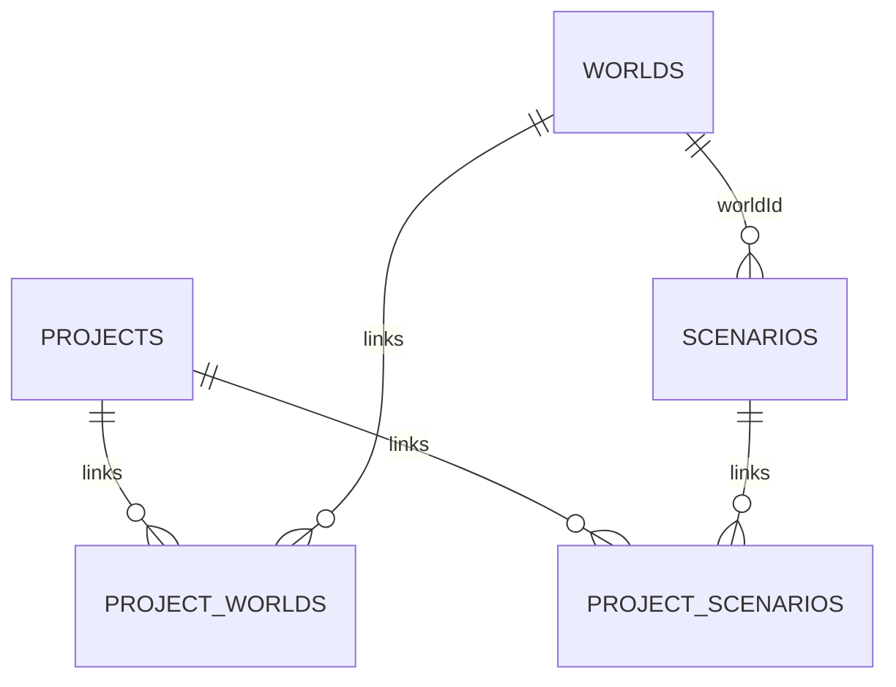

# Data model and persistence contract

Technical design for persistent fleet projects. A project contains shared project data, one or more reusable Worlds, and independent Scenarios bound to those Worlds. Save/load preserves authoritative inputs, not rendered Three.js objects or calculated results.

## Data model

| Entity | Principal data | Relationship / purpose |
|---|---|---|
| Project | ID, name, revision, timestamps, project document | One saved workspace referencing one World |
| Vehicle preset | Stable ID, name/category, propulsion/energy source, efficiency/range/charging capability, economics | Project-level reusable type, shared by every World |
| Fleet vehicle | A World object carrying a preset reference plus planning data | Belongs to the depot it stands in; placing a preset creates one |
| World | ID, name, revision, objects, transforms, scene settings | Reusable physical 3D depot |
| Scenario | ID, world ID, name, revision, planning inputs | Independent plan bound to one World; never embeds the World |
| ProjectScenario | Project ID, Scenario ID, World ID, order | Links compatible scenarios to a project |
| Result | Annual counts, cash flows, energy, emissions, feasibility issues | Derived; not persisted as authoritative input |

Geometry uses XZ ground coordinates in metres and rotations in radians. Scenario duplication copies planning data only; the project continues to reference the same World.

T03 Fleet & Scenario Data Engine owns the canonical fleet/scenario contracts. Per-vehicle transition decisions live in `ScenarioDocument.vehiclePlans`, keyed by the stable ID of a vehicle in the World that scenario is bound to. Each entry may contain `transitionYear` and `targetPresetId`. These are scenario-owned inputs: duplicating a scenario deep-copies them, editing one scenario must not mutate another, and derived results are never persisted. The structure remains intentionally compatible with the fuller scenario contract described in the simulation design.

The importable M1 shapes live in `apps/client/src/domain/contracts.ts`; the team integration and ownership rules are in the [M1 integration contract](m1-integration-contract.md). Project document version 4 holds the inputs every depot shares: the preset library and the analysis settings. World document version 4 adds `SceneObject.vehicle`, so a depot's fleet travels with its geometry. Scenario document version 2 adds explicit scenario assumptions while retaining vehicle plans. Project versions 2 and 3, scenario version 1 and world version 3 are legacy inputs during migration, not shapes for new feature work.

Because a vehicle is a World object, placing, editing and deleting one are ordinary scene edits and are therefore covered by scene undo. Vehicle presets remain project data and stay outside scene undo.

Common fuel price and emissions factors are project-owned so every scenario uses the same explicit baseline. Electricity tariffs, charging strategy/share and transition choices are scenario-owned because those inputs may differ between plans. Simulation and analytics results remain derived and are not saved.

## Validation and consistency

- Names are nonempty and limited to 100 characters.
- Object IDs are unique within their collections and references must resolve.
- Each project contains at least one scenario.
- Every Scenario must reference a World included in the same Project workspace.
- A Project may link multiple Worlds.
- Removing a Scenario removes it from the in-memory workspace immediately; Save Project removes its Project link and deletes the backing Scenario record when no other Project uses it.
- Unknown document/file versions are rejected explicitly.
- Invalid form drafts do not replace valid inputs.

## ProjectRepository

UI/state code depends on the `ProjectRepository` interface rather than on a storage technology. It provides:

- list saved projects
- load a complete workspace
- create an atomic workspace
- update an atomic workspace with expected revisions
- list/get reusable worlds
- list scenarios for one world only

The prototype implementation is native IndexedDB. Tests use an in-memory repository. A future HTTP/PostgreSQL implementation may implement the same interface.

## IndexedDB storage

Database: `fleet-transition-planner`, schema version 2.

Object stores:

| Store | Key / indexes | Content |
|---|---|---|
| `worlds` | key `id` | World records and serialized 3D document |
| `projects` | key `id` | Project records and project-level document |
| `scenarios` | key `id`, index `worldId` | Scenario records |
| `projectWorlds` | compound key `[projectId, worldId]`, indexes `projectId`, `worldId` | Ordered Project → World links |
| `projectScenarios` | compound key `[projectId, scenarioId]`, indexes `projectId`, `worldId` | Ordered Project → Scenario links |

One **Save Project** operation uses a single read/write transaction across all five stores and saves every in-memory World and Scenario. Project, World, and Scenario revisions detect stale writes from another tab. A failed transaction exposes no partial save.

## Portable project file

Export format identifier: `fleet-transition-planner-project`, version 2. Version 1 single-World files remain importable. The version 2 `.fleetproject` JSON contains:

- Project name and document
- All World names and full 3D documents
- Each World's Scenario names and documents
- Active World and active Scenario indexes
- Export timestamp

Export captures the live workspace, including unsaved edits. Import validates the structure and supported versions, then creates new project/world/scenario IDs before saving so imported data is an independent local copy.

Camera state, selection, gizmo settings, undo history, and derived results are excluded from persistence.

## Future API

Fastify/PostgreSQL code is retained as a future cloud-persistence path, but the current browser application does not call it for Project / World / Scenario persistence and does not require `DATABASE_URL`, PostgreSQL, Neon, or migrations to save/open a project.
