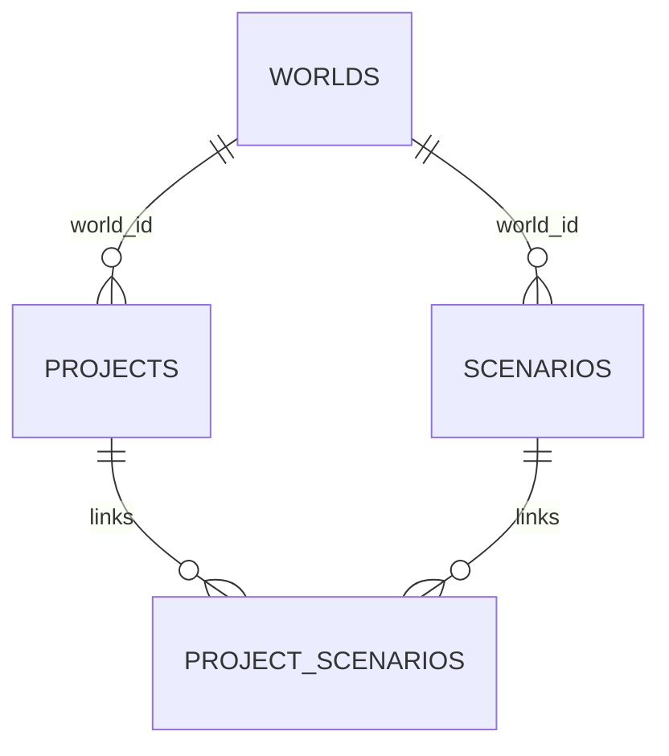

# Data model and API

Technical design for persistent fleet projects. A project contains a shared fleet and analysis context together with independent scenarios. Save/load preserves inputs, not rendered objects or calculated results.

## Data model

| Entity | Principal data | Relationship / purpose |
|---|---|---|
| Project | ID, name, revision, schema/model versions, timestamps | One consistent saved workspace |
| Analysis | Start year, duration, currency, fuel price, emissions factors | Shared baseline for all scenarios |
| Vehicle preset | Stable ID, name/category, propulsion/energy source, efficiency/range/charging capability, economics, maintenance, residual assumptions, physical dimensions | Shared project-level reusable preset |
| Vehicle | Stable ID, current preset reference, age, annual/daily distance, operations, replacement year | Shared fleet record |
| World | ID, name, revision, objects, transforms, scene settings | Reusable physical 3D depot referenced by projects and scenarios |
| Scenario | ID, world ID, name, vehicle transition years, charging strategy, tariffs | Independent plan bound to one world; never embeds the world document |
| Site | Boundary polygon, connection limit, obstacle polygons | Physical planning area |
| Bay | ID, position, dimensions, rotation | One vehicle assignment per bay |
| Charger | ID, position, dimensions, power, costs, installation year | One simultaneously usable charging connector |
| Result | Annual counts, cash flows, energy, emissions, feasibility issues, TCO, payback | Derived from the saved input model |

Owned vehicles distinguish acquisition/current value and end-of-analysis residual. Leased vehicles specify annual payment and exit fee. These choices follow the [calculation model](simulation.md).

Geometry uses XZ ground coordinates in metres and rotations in radians. Charger quantity is the number of charger instances, avoiding disagreement between the physical layout and the cost model. Scenario duplication copies scenario planning data only; the project continues to reference the same world.

## Validation and consistency

- All numeric inputs are finite. Costs, distances, emissions factors, and residuals are nonnegative; charger power, range, and footprint dimensions are positive.
- Analysis spans 1–20 whole years, starting between 2000 and 2100. Scheduled transitions, replacements, and installations lie within that period.
- Charging share is 0–100%; efficiency is greater than zero and at most 100%. Operating days range from 1–366; daily dwell from 0–24 hours.
- Names are nonempty and limited to 100 characters. Object IDs are unique within their collections, and references resolve within the project/scenario.
- Each project contains at least one scenario. Every linked scenario must have the same `world_id` as its project. A vehicle occupies at most one bay, and a bay holds at most one vehicle. Removing a scenario from a project unlinks it without deleting the separately saved scenario record.
- An empty fleet is valid. Undefined ratios display an explanation rather than zero, NaN, or Infinity.
- Invalid form drafts do not replace valid inputs. Structurally representable but spatially infeasible layouts can be saved with visible validation issues.
- One currency applies to the whole project; no currency conversion occurs. Unknown document/model versions are rejected explicitly.

## API

The API uses JSON under `/api/v1`. A workspace save is atomic even though the database stores projects, worlds, and scenarios separately. Expected revisions protect against conflicting browser tabs or another project editing the same shared world/scenario.

| Method and path | Purpose |
|---|---|
| GET /api/v1/projects | List saved projects |
| GET /api/v1/projects/:id/workspace | Load a project together with its referenced world and linked scenarios |
| POST /api/v1/workspaces | Create a project; create or reuse its world and scenarios atomically |
| PUT /api/v1/projects/:id/workspace | Revision-checked atomic Save Project |
| GET /api/v1/worlds | List reusable saved worlds |
| GET /api/v1/worlds/:id | Load one world |
| GET /api/v1/worlds/:id/scenarios | List only scenarios compatible with that world |
| GET /api/v1/ready | Confirm database connectivity |

Request bodies are limited to 10 MiB. Error responses use stable codes such as `VALIDATION_ERROR`, `NOT_FOUND`, `REVISION_CONFLICT`, `WORLD_MISMATCH`, and `DATABASE_UNAVAILABLE`. Failed saves preserve local edits.

## Storage and integrity

`worlds`, `projects`, and `scenarios` each carry their own revision and JSONB document. `project_scenarios` stores project ordering and repeats `world_id`; composite foreign keys require that both the project and scenario have that same world ID. This enforces compatibility in PostgreSQL, not only in the UI.

World documents contain persistent 3D objects and transforms. Scenario documents contain planning inputs only and never contain the world. Project documents contain project-level data such as vehicle presets. Workspace writes use a PostgreSQL transaction so no partial project/world/scenario save is visible.

Production PostgreSQL is Neon connected through the Vercel Marketplace. The pooled `DATABASE_URL` is server-only and migrations run automatically for Production deployments.

Camera state, selection, undo history, and derived results are excluded from persistent storage.
