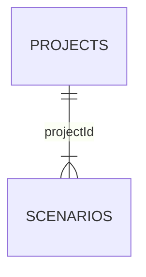

# Data model and persistence contract

A Project is one physical planning environment. It owns its scene, authoritative fleet, reusable vehicle presets, shared assumptions, and multiple Scenarios. Save/load preserves authoritative inputs, not Three.js meshes or calculated results.

## Data model

| Entity | Principal data | Relationship / purpose |
|---|---|---|
| Project | ID, name, revision, scene, fleet, presets, shared analysis settings | Aggregate and atomic persistence boundary |
| Fleet vehicle | Stable ID, optional preset ID, parking lot ID, operational inputs | One physical vehicle instance owned by the Project |
| Vehicle preset | Stable ID, model/type, powertrain, energy, cost, efficiency | Reusable configuration referenced by multiple vehicles |
| Scenario | ID, Project ID, order, revision, transition plans and assumptions | Alternative plan over the Project baseline |
| Result | Annual counts, cash flows, energy, emissions, feasibility issues | Derived; never authoritative persistence |

Geometry uses XZ ground coordinates in metres and rotations in radians. Scenario duplication deep-copies planning data only.

Project document version 4 contains `scene`, `vehiclePresets`, `fleetVehicles`, and `analysis`. Scenario document version 2 contains `vehiclePlans`, keyed by stable vehicle ID, and Scenario assumptions. Legacy multi-World Project documents and portable files are rejected; pre-release data is reset rather than migrated.

## Fleet invariants

- The Project fleet is authoritative; rendered vehicles are derived.
- Fleet vehicle IDs and preset IDs are unique within their collections.
- A vehicle has exactly one valid `parkingLotId`; no two vehicles share a lot.
- A vehicle has `presetId: null` or references one Project preset.
- The default depot exposes ten lots, so `fleetVehicles.length <= 10`.
- Every Scenario plan key resolves to a Project vehicle.
- Every target preset resolves to a Project preset.
- Deleting a vehicle removes its fleet entry and every Scenario plan keyed by its ID in the same domain edit.
- Changing a vehicle preset does not change its ID or invalidate Scenario references.
- Every Project contains at least one Scenario and the default depot scene object.

## Repository contract

UI/state code depends on `ProjectRepository`, which can:

- list saved Projects;
- load a complete Project workspace;
- create the aggregate atomically;
- update it atomically with expected Project and Scenario revisions.

IndexedDB schema version 3 has two stores:

```mermaid
erDiagram
  PROJECTS ||--|{ SCENARIOS : "projectId"
```

| Store | Key / indexes | Content |
|---|---|---|
| `projects` | key `id` | Project record and Project document |
| `scenarios` | key `id`, index `projectId` | Ordered Scenario records |

A failed transaction exposes no partial save. The PostgreSQL schema mirrors this relationship. Its destructive `0001_single_environment_projects.sql` migration deliberately drops pre-release multi-World tables and data.

## Portable project file

Format `fleet-transition-planner-project`, version 3, contains:

- Project name and complete Project document;
- ordered Scenario names and documents;
- active Scenario index;
- export timestamp.

Import validates the current format and creates fresh Project and Scenario IDs. Camera state, selection, transform controls, undo history, and derived results are excluded.
